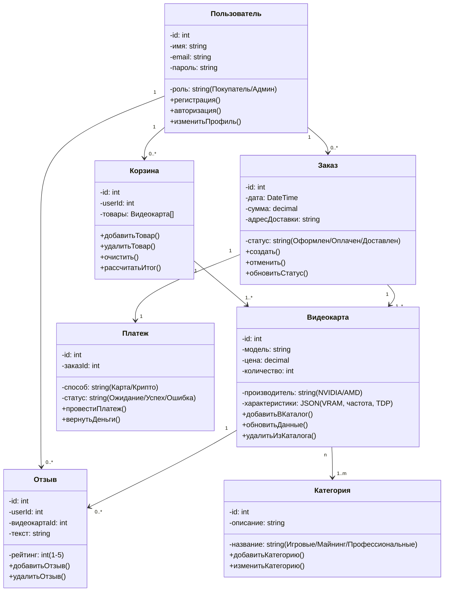
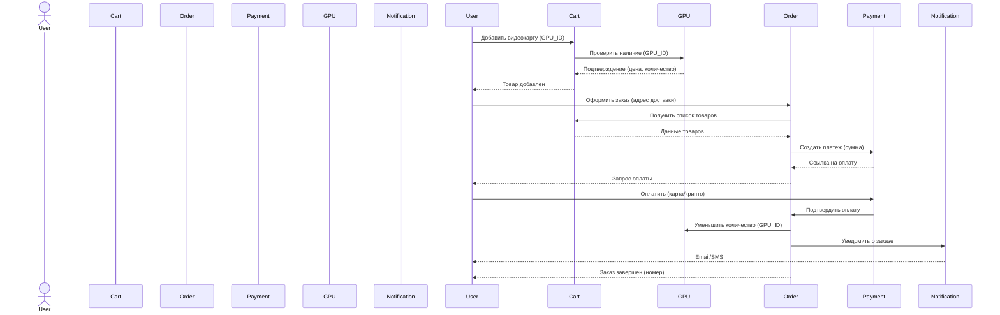

# CardsShop

# Диаграмма классов

Назначение: Отображает статическую структуру системы, основные сущности и их взаимосвязи.

Решаемая проблема:

Четкое определение ключевых объектов системы (например, товар, заказ, пользователь) и их атрибутов.

Устранение неоднозначностей в понимании структуры данных между разработчиками.

Ключевые аспекты:

Показаны 7+ классов с атрибутами (например, Видеокарта: цена, количество, модель) и методами (добавитьВКаталог()).

Типы связей: композиция (Заказ → Платеж), агрегация (Корзина → Видеокарта).

Польза для архитектуры:

Служит основой для проектирования базы данных (таблицы, поля, связи).

Помогает избежать дублирования кода (например, общие методы для Пользователя и Администратора).

# Диаграмма вариантов использования
```mermaid
useCaseDiagram
    title Use Case Diagram: Онлайн-магазин видеокарт
    left-to-right direction
    
    actor Guest as "Гость"
    actor Customer as "Покупатель"
    actor Admin as "Администратор"
    
    "Гость" --> (Browse Catalog) : "Просмотр каталога"
    "Гость" --> (Search Products) : "Поиск товаров"
    "Гость" --> (Register) : "Регистрация"
    
    "Покупатель" --> (Login) : "Авторизация"
    "Покупатель" --> (Manage Cart) : "Управление корзиной"
    "Покупатель" --> (Checkout) : "Оформление заказа"
    "Покупатель" --> (Write Review) : "Написание отзывов"
    
    "Администратор" --> (Manage Products) : "Управление товарами"
    "Администратор" --> (View Analytics) : "Аналитика продаж"
    
    note right of "Администратор"
        Может выполнять все действия Покупателя
    end note
    
    (Checkout) .> (Process Payment) : includes
    (Manage Cart) .> (Browse Catalog) : extends
```

Назначение: Описывает функциональные возможности системы с точки зрения пользователей.

Решаемая проблема:

Определение границ системы: что могут делать гости, покупатели, админы.

Планирование интерфейсов (например, скрыть кнопку «Оплата» для гостей).

Ключевые аспекты:

Use cases: Просмотр каталога, Оформление заказа, Модерация отзывов.

Связи между актерами: обобщение (Админ → Покупатель).

Польза для архитектуры:

Помогает проектировать ролевую модель (например, права доступа в API).

Упрощает создание пользовательских сценариев для тестирования.

# Диаграмма Последовательностей

Назначение: Визуализирует взаимодействие объектов в рамках сценария «Оформление заказа».

Решаемая проблема:

Определение порядка действий при критичных процессах (оплата, резервирование товара).

Выявление «узких мест» (например, проверка наличия товара перед оплатой).

Ключевые аспекты:

Последовательность шагов: от добавления в корзину до уведомления пользователя.

Участвующие объекты: Покупатель, Корзина, Платеж, Видеокарта.

Польза для архитектуры:

Позволяет оптимизировать вызовы методов (например, объединить запросы к БД).

Выявляет необходимость транзакций (например, откат при ошибке оплаты).
